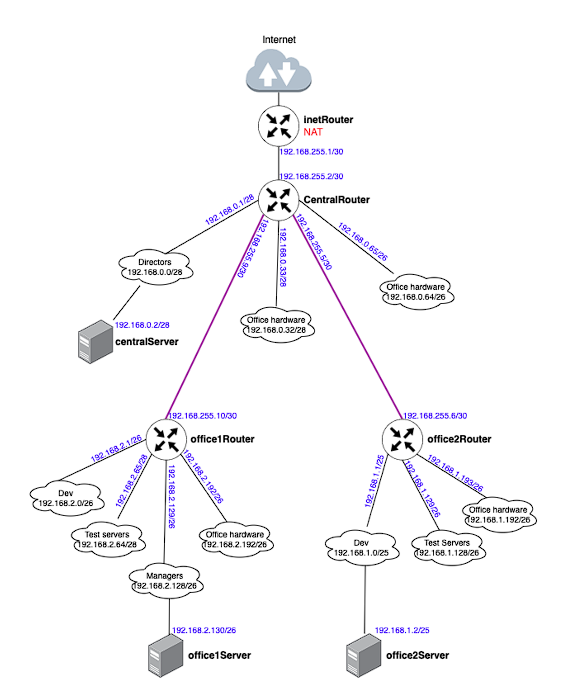

## OTUS Linux Professional - Урок 28. Архитектура сетей.

#### Цель домашнего задания:
Научится менять базовые сетевые настройки в Linux-based системах.

#### Описание домашнего задания:
1. Скачать и развернуть Vagrant-стенд https://github.com/erlong15/otus-linux/tree/network
2. Построить следующую сетевую архитектуру:
Сеть office1
- 192.168.2.0/26      - dev
- 192.168.2.64/26     - test servers
- 192.168.2.128/26    - managers
- 192.168.2.192/26    - office hardware

Сеть office2
- 192.168.1.0/25      - dev
- 192.168.1.128/26    - test servers
- 192.168.1.192/26    - office hardware

Сеть central
- 192.168.0.0/28     - directors
- 192.168.0.32/28    - office hardware
- 192.168.0.64/26    - wifi


Итого должны получиться следующие сервера:
- inetRouter
- centralRouter
- office1Router
- office2Router
- centralServer
- office1Server
- office2Server

Задание состоит из 2-х частей: теоретической и практической.

В теоретической части требуется:
1. Найти свободные подсети
2. Посчитать количество узлов в каждой подсети, включая свободные
3. Указать Broadcast-адрес для каждой подсети
4. Проверить, нет ли ошибок при разбиении

В практической части требуется: 
1. Соединить офисы в сеть согласно логической схеме и настроить роутинг
2. Интернет-трафик со всех серверов должен ходить через inetRouter
3. Все сервера должны видеть друг друга (должен проходить ping)
4. У всех новых серверов отключить дефолт на NAT (eth0), который vagrant поднимает для связи
5. Добавить дополнительные сетевые интерфейсы, если потребуется

### Инструкция по выполнению домашнего задания:

> [!CAUTION]
> В данном репозитории все задания практической работы выполняются с помощью Ansible при создании виртуальных машин командой `vagrant up`

__Теоретическая часть__

Создаем таблицу топологии:

Согласно таблице видим следующие свободные подсети в указаных сетях класса С:
- 192.168.0.16/28
- 192.168.0.48/28
- 192.168.0.128/25
- 192.168.255.128/25
- 192.168.255.64/26
- 192.168.255.32/27
- 192.168.255.16/28
- 192.168.255.8/29
- 192.168.255.4/30

__Практическая часть__

Схема сети, которую будем настраивать:



На основании этой схемы получаем следующий список серверов:

|Server|IP/Prefix|
|---|---|
|inetRouter|Default-NAT address VirtualBox|
||192.168.255.1/30|
|||
|centralRouter|192.168.255.2/30|
||192.168.0.1/28|
||192.168.0.33/28|
||192.168.0.65/26|
||192.168.255.9/30|
||192.168.255.5/30|
|||
|centralServer|192.168.0.2/28|
|||
|office1Router|192.168.255.10/30|
||192.168.2.1/26|
||192.168.2.65/26|
||192.168.2.129/26|
||192.168.2.193/26|
|||
|office1Server|192.168.2.130/26|
|||
|office2Router|192.168.255.6/30|
||192.168.1.1/25|
||192.168.1.129/26|
||192.168.1.193/26|
|||
|office2Server|192.168.1.2/25|

__Задача__ : нужно настроить маршрутизацию и NAT таким образом, чтобы доступ в Интернет со всех хостов был через inetRouter и каждый сервер должен быть доступен с любого из 7 хостов.

1. Создаем виртуальные машины с Vagrantfile'а:
```console
$ vagrant up
```
2. Настраиваем маршрутизатор inetRouter:
- Настраиваем NAT
Проверяем что отключен фаервол ufw и отключаем его если включен:
```console
root@inetRouter:~# systemctl status ufw
● ufw.service - Uncomplicated firewall
     Loaded: loaded (/lib/systemd/system/ufw.service; enabled; vendor preset: enabled)
     Active: active (exited) since Wed 2024-07-03 18:03:43 UTC; 1h 0min ago
       Docs: man:ufw(8)
   Main PID: 523 (code=exited, status=0/SUCCESS)
        CPU: 586us

root@inetRouter:~# systemctl stop ufw
root@inetRouter:~# systemctl disable ufw
```
Включаем маскарадинг:
```console
root@inetRouter:~# iptables -t nat -A POSTROUTING ! -d 192.168.0.0/16 -o eth0 -j MASQUERADE
```
Посмотреть правила iptables:
```console
root@inetRouter:~# iptables -L -v -t nat
```
Далее правила iptables нужно сохранить и настроить их автоматическую настройку после перезагрузки машрутизатора. Сохраняем правила в файл:
```console
root@inetRouter:~# iptables-save > /etc/iptables.rules
```
Создаём файл /etc/network/if-pre-up.d/iptables, в который добавим скрипт автоматического восстановления правил при перезапуске системы:
```shell
#!/bin/sh
 iptables-restore < /etc/iptables.rules
 exit 0
```
```console
root@inetRouter:~# chmod +x /etc/network/if-pre-up.d/iptables
```
Включаем маршрутизацию транзитных пакетов:
```console
root@inetRouter:~# echo "net.ipv4.conf.all.forwarding = 1" >> /etc/sysctl.conf
root@inetRouter:~# sysctl -p
```
Также машрузацию транзитных пакетов нужно включить на __centralRouter__, __office1Router__, __office2Router__

2. Отключаем маршрут по умолчанию на все устройствах, кроме __inetRouter__

При разворачивании стенда Vagrant создает в каждом сервере свой интерфейс, через который у сервера появляется доступ в интернет. Отключить данный порт нельзя, так как через него Vagrant подключается к серверам. Обычно маршрут по умолчанию прописан как раз на этот интерфейс, данный маршрут нужно отключить.

Для отключения маршрута по умолчанию в файле /etc/netplan/00-installer-config.yaml добавляем отключение маршрутов, полученных через DHCP:
```yaml
# This is the network config written by 'subiquity'
network:
  ethernets:
    eth0:
      dhcp4: true
      dhcp4-overrides:
        use-routes: false
      dhcp6: false
  version: 2
```
После внесения данных изменений перезапускаем сетевую службу:
```console
root@centralRouter:~# netplan try
```
3. Настраиваем статические маршруты
Временно (до первой перезагрузки) статические маршруты можно установить командой:
```console
root@office1Server:~# ip route add 0.0.0.0/0 via 192.168.2.129
```
Удалить маршрут:
```console
root@office1Server:~# ip route del 0.0.0.0/0 via 192.168.2.129
```
Для того, чтобы маршруты сохранялись после перезагрузки нужно их указывать непосредственно в файле конфигурации сетевых интерфейсов:

В современных версиях Ubuntu, для указания маршрута нужно поправить netplan-конфиг. Конфиги netplan хранятся в виде YAML-файлов и обычно лежат в каталоге /etc/netplan
В нашем стенде такой файл - `/etc/netplan/50-vagrant.yaml` 

Для добавления маршрута, после раздела addresses нужно добавить блок:
```yaml
routes:
  - to: <сеть назначения>/<маска>
    via: <Next hop address>
```
Пример файла `/etc/netplan/50-vagrant.yaml`
```yaml
---
network:
  version: 2
  renderer: networkd
  ethernets:
    enp0s8:
      addresses:
      - 192.168.2.130/26
      routes:
      - to: 0.0.0.0/0
        via: 192.168.2.129
    enp0s19:
      addresses:
      - 192.168.50.21/24
```
Применить настройки:
```console
root@centralRouter:~# netplan try
```
Подобным образом настраваем маршруты на всех необходимых устройствах.

4. Устанавливаем traceroute и проверяем выход в интернет на серверах:
```console
root@office1Server:~# apt install -y traceroute
root@office1Server:~# traceroute -n 8.8.8.8
```
